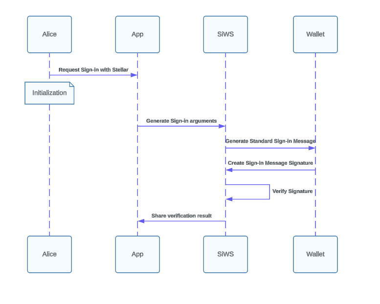

## Preamble

```
SEP: To Be Assigned
Title: Sign in with Stellar
Author: Mahmoud Alkhraishi <@mkhraisha>
Track: Informational
Status: Draft
Created: 2024-06-06
Updated: 2024-06-06
Version: 0.1.0
Discussion: N/A
```

## Simple Summary

Sign in with Stellar attempts to provide a standard way for users to sign in to websites using their Stellar account. This is a unique profile of the SEP-10 Authentication intended only to provide a simple and secure way for users to sign in to websites using their Stellar account.

## Dependencies

SEP-10 is a required dependency for this SEP.

## Motivation

[Sign in with Ethereum](https://login.xyz/) provides an easy way to sign in to websites using your Ethereum account. SEP-10 attempts to provide a similar ability for Stellar users, however because it does not have a simple predefined flow for a wallet to access a DAPP, it is not as simple as Ethereum. This SEP attempts to provide a simple and secure way for users to sign in to websites using their Stellar account.

## Abstract

Sign in with Stellar enables a wallet to sign a challenge from a website to prove that the user owns a Stellar account. This is done by the website providing a challenge to the wallet, the wallet signing the challenge with the user's Stellar account, and the wallet returning the signature to the website. The website can then verify the signature to prove that the user owns the Stellar account. A backend server is not required for this flow, as the website can verify the signature directly. It also removes the requirements for an invalid transaction to be created, as the signature can be verified directly. It also provides a simple library to make it easy for wallets and websites to implement this flow.

## Specification

TODO: Fully fleshed out Spec for v1.0.0, The current spec is just a simple flow, a fully fleshed out spec will be part of the deliverables for v1.0.0.

1. The website generates a random challenge.
2. The website sends the challenge to the wallet.
3. The wallet signs the challenge with the user's Stellar account.
4. The wallet returns the signature to the website.
5. The website verifies the signature to prove that the user owns the Stellar account.



## Design Rationale

TODO: When spec is fully fleshed out outline alternatives and why this design was chosen.

### Key consideration

Implementers of this profile should be compliant with SEP-10, this should allow for a simpler implementation of SEP-10 to allow for easier adoption by limiting options, using a standardized message, and removing the need to check for a valid transaction.

## Security Concerns

N/A

## Changelog

- `0.1.0`: Initial draft
